# **Milestone 2 – Secure LLM Dashboard & Analytics System**

---

## 📌 Project Title

**Secure LLM-Based Dashboard with Authentication, Chat Management, Readability Analytics, and Admin Control using Streamlit, SQLite, JWT, and Ngrok**

---

## 📖 Description

In **Milestone 2**, the User Authentication System developed in Milestone 1 was extended into a **secure, feature-rich dashboard application**. This milestone introduces **multi-user chat management**, **text readability analytics**, **data export capabilities**, and an **admin command center**, all protected by strong authentication and recovery mechanisms.

The application is developed using **Streamlit** for the frontend, **SQLite** for database storage, **JWT and OTP-based verification** for enhanced security, and **Ngrok** for generating a public URL to access the locally hosted application.

This milestone lays the foundation for future **LLM-powered AI features**, including intelligent chat, document analysis, and policy-based insights.

---

## 🚀 Features Implemented

### 1. Secure User Authentication

* User Signup with:

  * Username validation
  * Email format validation
  * Password validation (8–20 characters, special characters required)
  * Security question and answer
* Secure password hashing
* Login using Email ID and Password
* Session-based authentication
* Logout functionality

---

### 2. Forgot Password & Recovery System

* Password recovery using:

  * **Email OTP verification**
  * **Security question verification**
* OTP generated securely and verified using JWT and bcrypt
* OTP expiry mechanism
* Password reset with validation
* Prevention of old password reuse

---

### 3. Nebula Chat System

* Multi-threaded chat system for each user
* Create, rename, and delete chat threads
* Persistent chat history stored in SQLite
* Role-based message storage (user / assistant)
* Export chat history as CSV
* Clear entire chat history

---

### 4. Cognitive Text Scanner (Readability Analyzer)

* Manual text input (minimum 50 characters)
* File upload support:

  * TXT files
  * PDF files
* Readability metrics:

  * Flesch Reading Ease
  * Flesch–Kincaid Grade
  * SMOG Index
  * Gunning Fog Index
  * Coleman–Liau Index
* Interactive visual analytics using Plotly
* Scan history storage
* Export readability data as CSV
* Delete individual or all records

---

### 5. Void Storage (Data Management)

* Centralized data export system
* Download:

  * Chat logs
  * Readability analysis data
* Bulk deletion of user data
* Secure user-wise data isolation

---

### 6. Admin Command Center

* Admin-only access
* View all registered users
* Delete users from the system
* Automatic cleanup of:

  * User accounts
  * Chat history
  * Readability records

---

### 7. UI & Experience Enhancements

* Galaxy-themed UI using custom CSS
* Glassmorphism effects
* Responsive layout
* Sidebar-based navigation

---

### 8. Ngrok Integration

* Streamlit application hosted locally
* Ngrok used to generate a public URL
* Enables remote access and live demonstrations

---

## 🛠 Technologies Used

* Python
* Streamlit
* SQLite3
* JWT (JSON Web Tokens)
* bcrypt
* SMTP (Email OTP delivery)
* Pyngrok
* Plotly
* Textstat
* PyPDF2
* Google Colab

---

## ▶️ Steps to Run the Application

### Step 1: Install Required Libraries

```bash
pip install streamlit pyjwt bcrypt python-dotenv pyngrok nltk streamlit-option-menu plotly textstat PyPDF2
```

---

### Step 2: Set Environment Variables

```bash
EMAIL_PASSWORD=your_email_app_password
JWT_SECRET=your_secret_key
NGROK_AUTHTOKEN=your_ngrok_token
```

---

### Step 3: Run the Streamlit Application

```bash
streamlit run app.py
```

---

### Step 4: Connect Ngrok (Optional – For Public Access)

```python
from pyngrok import ngrok
ngrok.set_auth_token("YOUR_NGROK_AUTH_TOKEN")
```

---

## 🔑 Admin Login Credentials

The application includes a **default admin account** for demonstration and evaluation purposes.

**Admin Email ID:**

```
sasdfghj771@gmail.com
```

**Admin Password:**

```
Bhavi@123
```

> ⚠️ **Note:**
> These credentials are intended **only for academic/demo purposes**.
> In a production environment, admin credentials should be securely stored and never hardcoded.

---

## 📸 Screenshots

### 🔐 Authentication & Recovery

* Login Page
  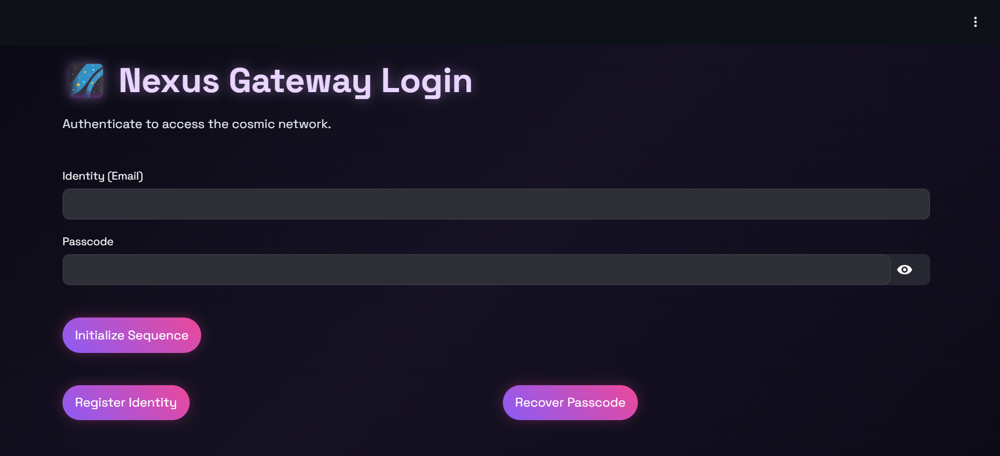

* Signup Page
  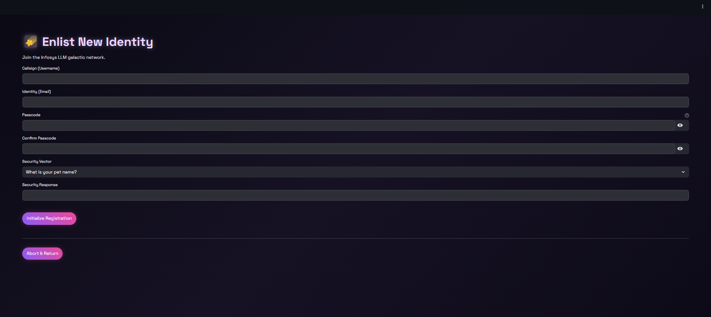

* Forgot Password – Email Verification
  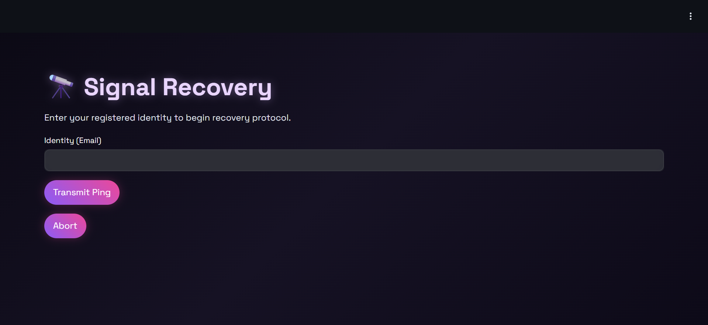

* Password Reset Options
  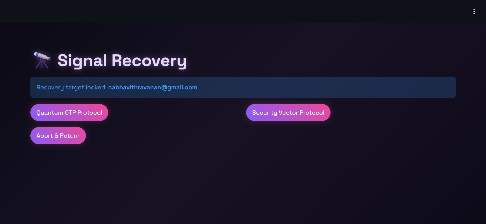

* OTP Verification
  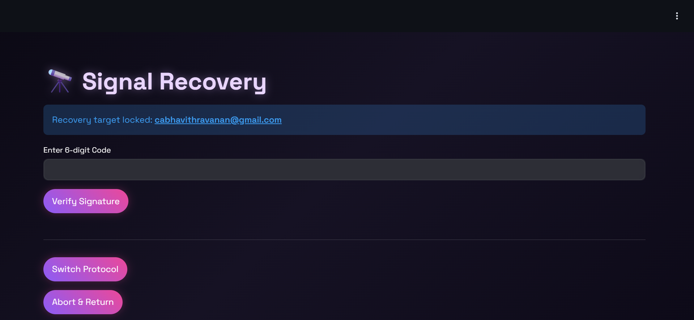

* OTP Mail
  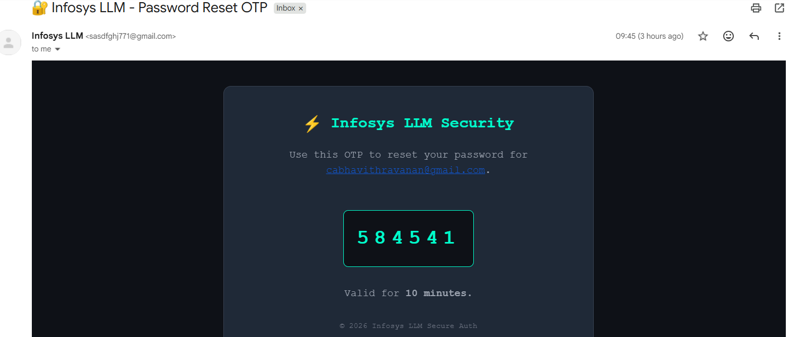

* Security Code Verification
  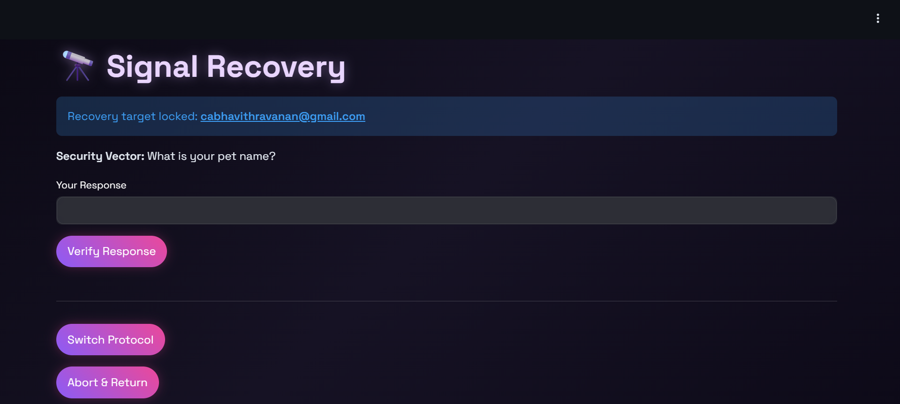

---

### 👤 User & Chat

* User Dashboard
  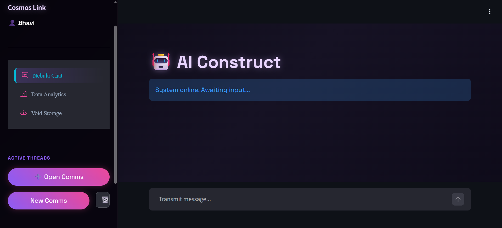

* Chat History
  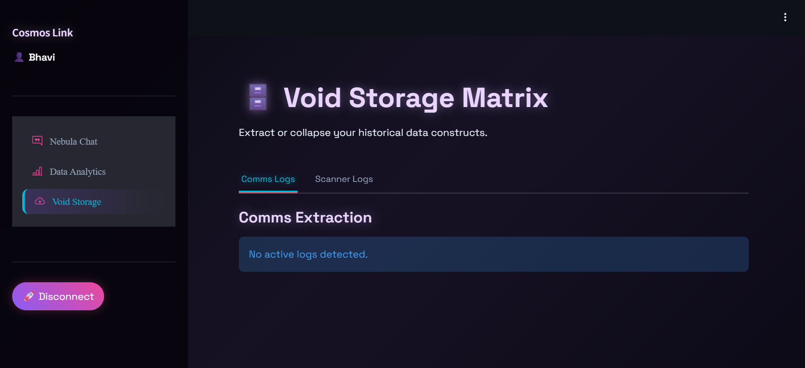

* User History
  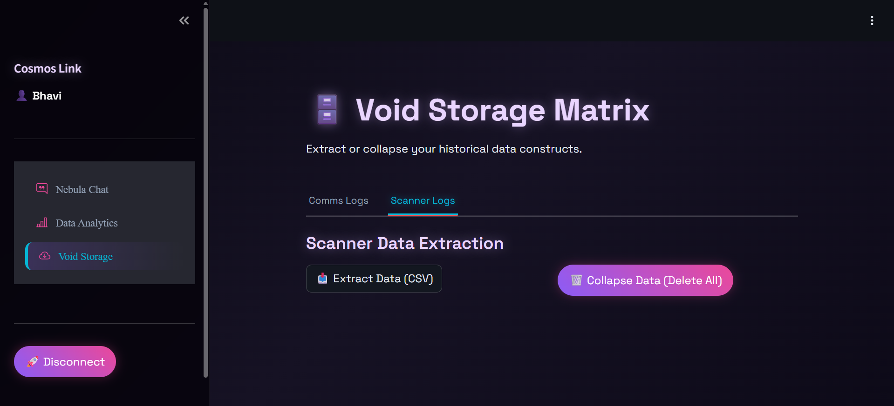  

---

### 📊 Analytics

* File Readability Analyzer
  

  * File Readability Analyzer
  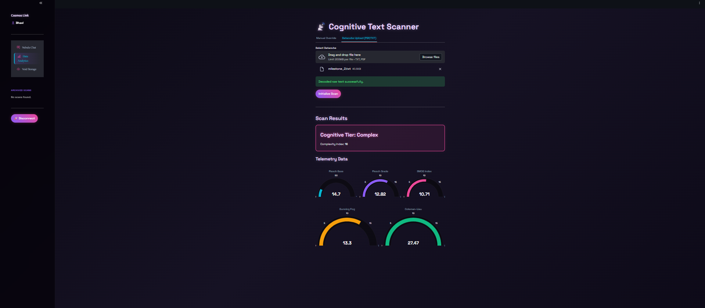


---

### 🛡️ Admin Module

* Admin Login
  

* Admin Dashboard
  

---

## 📂 Project Structure

```
milestone2/
│
├── app.py
├── MileStone_2.ipynb
├── README.md
├── screenshots/
│   ├── Login.png
│   ├── Sign_up.png
│   ├── Forgot_password_email_verification.png
│   ├── Password_Reset_Options.png
│   ├── OTP_Verification.png
│   ├── OTP_mail.png
│   ├── Security_code.png
│   ├── User_page.png
│   ├── history.png
│   ├── File_Readability.png
│   ├── Admin.png
│   └── Admin_Dashboard.png
```

---

## 🌐 Demonstration Link

**Ngrok Public URL:**
*https://moonily-jubilatory-curt.ngrok-free.dev/*

---

## ✅ Milestone 2 Outcome

Successfully developed a **secure, scalable dashboard system** with:

* Strong authentication and recovery mechanisms
* Persistent chat management
* Advanced readability analytics
* Secure data export and deletion
* Admin-level system control
* Public access using Ngrok

This milestone forms a **robust foundation for future LLM-based AI integration**.

---

## 👨‍💻 Author

**Student Name:** Bhavithravanan C A
**Program:** Infosys Springboard Internship
**Milestone:** Milestone 2 – Secure LLM Dashboard & Analytics System

